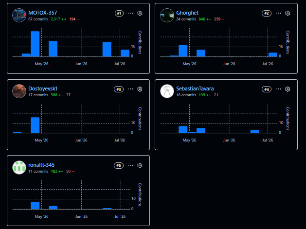
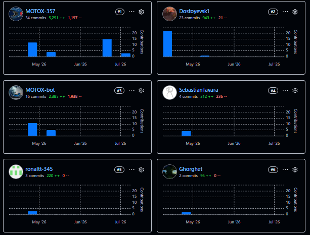
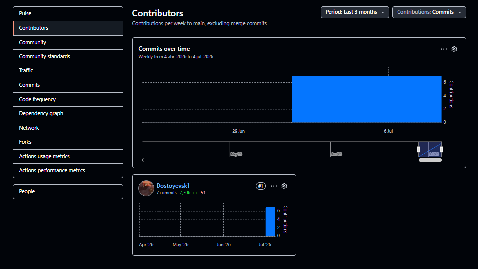
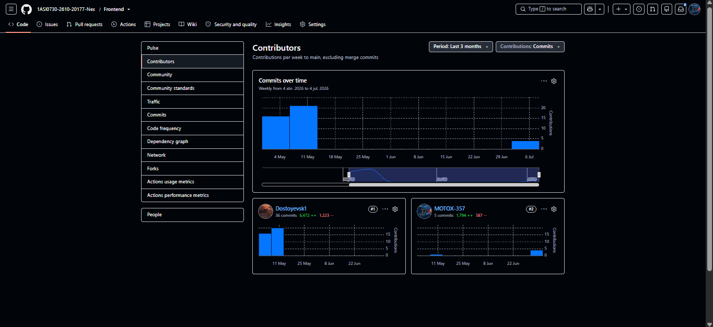

Skip to content
1ASI0730-2610-20177-Nex
Report
Repository navigation
Code
Issues
Pull requests
Actions
Projects
Wiki
Security and quality
Insights
Settings
Files
Go to file
t
T
assets
README.md
Report
/
README.md
in
develop

Edit

Preview
Indent mode

Spaces
Indent size

2
Line wrap mode

Soft wrap
Editing README.md file contents
  1
  2
  3
  4
  5
  6
  7
  8
  9
 10
 11
 12
 13
 14
 15
 16
 17
 18
 19
 20
 21
 22
 23
 24
 25
 26
 27
 28
 29
 30
 31
 32
 33
 34
 35
 36
 37
 38
 39
 40
 41
 42
 43
 44
 45
 46
 47
 48
 49
 50
 51
 52
 53
 54
 55
 56
 57
 58
 59
 60
 61
 62
 63
 64
 65
 66
 67
 68
 69
 70
 71
 72
 73
 74
 75
 76
 77
 78
 79
 80
 81

</img> 

<h3>Universidad Peruana de Ciencias Aplicadas</h3>
<h4>Facultad de Ingeniería</h4>
<h4>Carrera de Ingeniería de Software</h4>
<h4>Periodo 202610</h4>
<h4>1ASI0730 Aplicaciones Web</h4>
<h4>NRC 20177</h4>
<h4>Docente: Jose Miguel Flores ingaruca</h4>
<h4>Informe del Trabajo Final</h4>
<h4>Startup: ElectroCorp</h4>
<h4>Producto: Smart Control</h4>

| **Código** | **Apellidos y Nombres**               |
| :--------: | :------------------------------------ |
| U20241e179 | Tavara Correa, Sebastian Oswaldo      |
| U20241e107 | Tuncar Vila, Ghorghet Saul|
| U20241e014 | Cabrejos Chocco, Diego Alexander      |
| U202019498 | Fernandez Garfias Alexander Piero     |
| U20241e367 | Toro Turpo Ronal                      |

### Mayo 2026

## Registro de Versiones del Informe

| Versión | Fecha | Autor | Descripción de modificación |
| :---: | :---: | :--- | :--- |
| AV1 | 22/04/2026 | Tavara Correa, Sebastian Oswaldo; Tuncar Vila, Ghorghet Saul; Cabrejos Chocco, Diego Alexander; Fernandez Garfias Alexander Piero; Toro Turpo Ronal | Primer avance del informe: desarrollo de la información de la startup, identificación de la problemática, definición de los segmentos objetivo, requerimientos iniciales y documentación base del proyecto. |
| TB1 | 09/05/2026 | Tavara Correa, Sebastian Oswaldo; Tuncar Vila, Ghorghet Saul; Cabrejos Chocco, Diego Alexander; Fernandez Garfias Alexander Piero; Toro Turpo Ronal | Primera entrega del producto: implementación y actualización de la Landing Page, desarrollo de la primera versión de la Frontend Web Application, conexión entre ambas aplicaciones y actualización de la documentación técnica del proyecto. |
| AV2 | 18/06/2026 | Tavara Correa, Sebastian Oswaldo; Tuncar Vila, Ghorghet Saul; Cabrejos Chocco, Diego Alexander; Fernandez Garfias Alexander Piero; Toro Turpo Ronal | Segundo avance del producto y del informe: mejora del Frontend mediante los módulos Analytics y Payments, actualización de rutas, Sidebar y configuración del entorno; creación de la primera versión del Backend REST de ElectroCorp con persistencia en MySQL y documentación mediante Swagger/OpenAPI; incorporación completa del Sprint 3, sus evidencias de desarrollo y ejecución, colaboración del equipo y actualización del Student Outcome 3. |
| TB2 | 2/07/2026 | Tavara Correa, Sebastian Oswaldo; Tuncar Vila, Ghorghet Saul; Cabrejos Chocco, Diego Alexander; Fernandez Garfias Alexander Piero; Toro Turpo Ronal | Tercer avance del producto y del informe: mejora del Frontend y configuración del entorno; creación de la segunda versión del Backend REST de ElectroCorp con persistencia en MySQL y documentación mediante Swagger/OpenAPI; incorporación completa del Sprint 4, sus evidencias de desarrollo y ejecución, colaboración del equipo y actualización del Student Outcome
proyecto. |

## Project Report Collaboration Insights
A continuación, se detallan los repositorios utilizados a lo largo del proyecto:

#### Link del repositorio del Reporte:

- https://github.com/1ASI0730-2610-20177-Nex/Report

#### Link del repositorio de la Landing Page:

- https://github.com/1ASI0730-2610-20177-Nex/LandingPage

#### Link del repositorio del Frontend:

- https://github.com/1ASI0730-2610-20177-Nex/Frontend

#### Link del repositorio del Backend:

- https://github.com/1ASI0730-2610-20177-Nex/Backend

### **Entrega TB2:**
Para el TB2, todo el equipo se encargo de resolver los avances para el TB2, arreglando algunas cosas, corrigiendo otras. Se repartio el trabajo y se coordino de forma online.

##### Participación por integrante:
</img> 
</img> 
</img> 
</img> 

# Contenido

## Índice

- [Registro de versiones del informe](#registro-de-versiones-del-informe)

- [Project Report Collaboration Insights](#project-report-collaboration-insights)

- [Contenido](#contenido)

- [Student Outcome](#student-outcome-1)

- [Capítulo I: Introducción](#capitulo-i-introduccion)
Use Control + Shift + m to toggle the tab key moving focus. Alternatively, use esc then tab to move to the next interactive element on the page.
Sin archivos seleccionados
Attach files by dragging & dropping, selecting or pasting them.
 
assets content loaded
